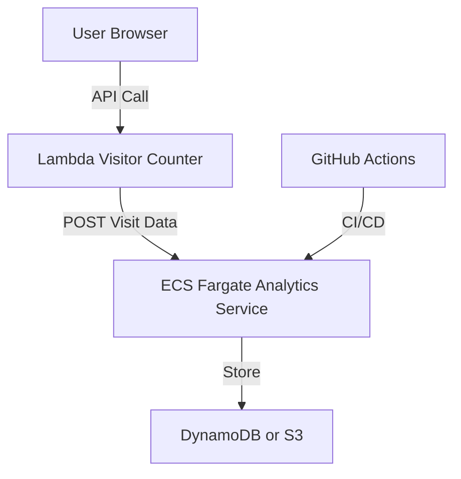

# 🚀 Future Upgrade: ECS/Fargate Analytics Microservice

## Overview

To enhance the project and learn AWS ECS/Fargate, we will add a containerized analytics microservice.  
This service will collect and store detailed visit analytics, providing a foundation for future dashboards and insights.

---

## Use Case

- **Purpose:**  
  Track detailed visit analytics (timestamp, IP, user agent, etc.) for each website visit.
- **How:**  
  A lightweight REST API (Flask or Express) runs in a Docker container on ECS Fargate.  
  The Lambda visitor counter (or frontend) sends visit data to this service, which stores it in DynamoDB or S3.

---

## Requirements

### Functional

- Expose a `/log-visit` POST endpoint to receive analytics data.
- Store each visit’s metadata (timestamp, IP, user agent, etc.) in DynamoDB or S3.
- (Optional) Expose a `/stats` GET endpoint for future dashboard use.

### Non-Functional

- Must run as a container on ECS Fargate (no EC2 management).
- Must be scalable and stateless.
- Must be secured (private subnet, security groups, IAM roles).
- Must be managed via Terraform.

---

## Architecture Diagram



---

## Implementation Plan & TODO

### 1. Analytics Microservice

- [ ] Write a simple REST API (`/log-visit`) in Flask or Express.
- [ ] Accept JSON payload with visit metadata.
- [ ] Store received data in DynamoDB or S3.
- [ ] Dockerize the application (`Dockerfile`).
- [ ] Push the image to Amazon ECR.

### 2. ECS/Fargate Infrastructure

- [ ] Add Terraform code for:
  - [ ] ECR repository
  - [ ] ECS cluster
  - [ ] Fargate task definition and service
  - [ ] Application Load Balancer (ALB)
  - [ ] Security groups and IAM roles

### 3. Integration

- [ ] Expose the ECS service via ALB endpoint.
- [ ] Update Lambda function to POST visit data to the new analytics endpoint.
- [ ] (Optional) Allow frontend to POST directly if desired.

### 4. CI/CD

- [ ] Add GitHub Actions workflow to:
  - [ ] Build and push Docker image to ECR
  - [ ] Deploy/Update ECS service via Terraform

### 5. Documentation & Diagrams

- [ ] Update `README.md` and architecture diagrams.
- [ ] Document API endpoints and usage.
- [ ] Add troubleshooting and security notes.

---

## Example API Payload

```json
{
  "timestamp": "2024-07-01T12:34:56Z",
  "ip": "203.0.113.42",
  "user_agent": "Mozilla/5.0 ...",
  "referrer": "https://example.com"
}
```

---

## Notes

- Start simple: focus on logging visits, then expand to stats and dashboards.
- Use environment variables for configuration (e.g., DynamoDB table name, region).
- Secure the ALB endpoint (e.g., restrict to Lambda’s security group or use an API key).

---

*This document will be updated as