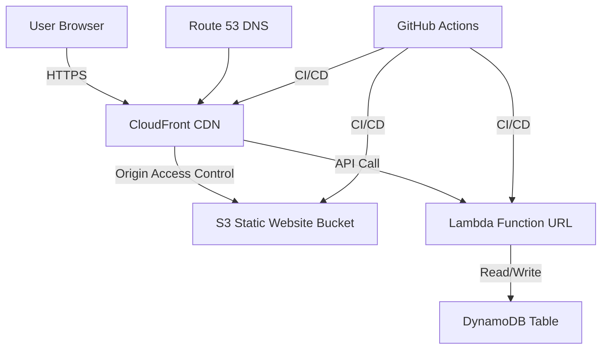

# 🌸 Washington D.C. Cherry Blossom Festival – Cloud Resume Challenge Inspired Project

---

## Table of Contents

- [Project Overview](#project-overview)
- [Architecture Diagram](#architecture-diagram)
- [Features](#features)
- [Tech Stack](#tech-stack)
- [Infrastructure as Code (Terraform)](#infrastructure-as-code-terraform)
- [CI/CD Workflows](#cicd-workflows)
- [How to Deploy & Operate](#how-to-deploy--operate)
- [Configuration & Secrets](#configuration--secrets)
- [Folder Structure](#folder-structure)
- [Security & Best Practices](#security--best-practices)
- [Troubleshooting](#troubleshooting)
- [Credits](#credits)
- [Future Plans](#future-plans)

---

## Project Overview

This project is a cloud-native, serverless web application inspired by the [Cloud Resume Challenge](https://cloudresumechallenge.dev/).  
Instead of a resume, it features a static website about the Washington D.C. Cherry Blossom Festival.  
It demonstrates modern DevOps and cloud engineering practices using AWS, Terraform, and GitHub Actions.

---

## Architecture Diagram

## Features

- **Static Website Hosting**: The website is hosted on Amazon S3, with content delivered via CloudFront CDN for low latency and high availability.
- **Serverless Backend**: Visitor counter functionality is powered by a Lambda function, with data stored in DynamoDB.
- **Infrastructure as Code**: Terraform is used to manage and provision all infrastructure components, ensuring reproducibility and easy management.
- **Continuous Integration/Continuous Deployment (CI/CD)**: GitHub Actions automate the deployment of both the website and the underlying infrastructure.

## Tech Stack

- **Frontend**: HTML, CSS, JavaScript
- **Backend**: AWS Lambda (Node.js)
- **Database**: Amazon DynamoDB
- **Infrastructure**: Terraform
- **CI/CD**: GitHub Actions
- **Hosting**: Amazon S3, Amazon CloudFront
- **DNS Management**: Amazon Route 53

## Infrastructure as Code (Terraform)

Terraform is used to define and provision the infrastructure for the project. The configuration is split into two main parts: backend and front-end.

### Backend Infrastructure - `/infra/back-end.tf`
This Terraform configuration sets up the backend infrastructure, including:
- **AWS Lambda Function**: Handles visitor tracking and updates the visitor count in DynamoDB.
- **IAM Role and Policy**: Grants necessary permissions to the Lambda function.
- **Lambda Function URL**: Exposes the Lambda function as an HTTP endpoint.
- **DynamoDB Table**: Stores the visitor count data.
- **Config.js in S3**: Contains the Lambda function URL for frontend access.

### Front-End Infrastructure - `/infra/front-end.tf`
This configuration sets up the front-end infrastructure, which consists of:
- **S3 Bucket**: Hosts the static website files.
- **CloudFront Distribution**: Provides a CDN for the website, with caching and HTTPS support.
- **S3 Bucket Policy**: Secures the S3 bucket, allowing access only through CloudFront.
- **Origin Access Control (OAC)**: Restricts direct access to the S3 bucket.
- **Route 53 DNS Record**: Configures a custom domain for the website.

## CI/CD Workflows

GitHub Actions are used to automate the deployment and management of the infrastructure and website.

### Front-End Deployment - `/github/workflows/front-end-cicd.yml`
This workflow automates the deployment of the front-end code to the S3 bucket. It is triggered by:
- Manual execution
- Push events to the main branch
It synchronizes the local `CherryBlossom/` folder with the S3 bucket and invalidates the CloudFront cache.

### Infrastructure Preview - `/github/workflows/infra-preview.yml`
This workflow runs `terraform plan` to preview infrastructure changes. It is triggered by:
- Manual execution
- Pull request events for the `infra/` directory
This allows reviewing of infrastructure changes before they are applied.

### Infrastructure Update - `/github/workflows/infra-update.yml`
This workflow applies infrastructure changes using Terraform. It is triggered by:
- Manual execution
- Push events to the main branch for changes in the `infra/` directory
It runs `terraform plan` and `terraform apply` to update the infrastructure.

### Infrastructure Destroy - `/github/workflows/infra-update.yml`
This workflow tears down the infrastructure by running `terraform destroy`. It is triggered only manually, ensuring that destruction of resources is intentional.

## How to Deploy & Operate

To deploy and operate this project, follow these steps:

1. **Clone the Repository**: `git clone <repo-url>`
2. **Configure AWS Credentials**: Ensure your AWS credentials are configured, either through environment variables or the AWS CLI.
3. **Update Terraform Variables**: Modify the `terraform.tfvars` file with your specific values, including AWS region, domain name, and S3 bucket name.
4. **Deploy Infrastructure**: Run the CI/CD workflows for Terraform to provision the infrastructure.
5. **Deploy Front-End**: Update the front-end code in the `CherryBlossom/` folder and run the front-end CI/CD workflow to deploy changes.

## Configuration & Secrets

The project requires certain configuration values and secrets, which are managed as GitHub repository secrets:

- **ALTERNATE_DOMAIN_NAME**: The custom domain name for the website.
- **DYNAMO_DB_TABLE_NAME**: The name of the DynamoDB table for storing visitor count.
- **LAMBDA_FUNCTION_NAME**: The name of the Lambda function.
- **S3_BUCKET_NAME**: The name of the S3 bucket hosting the website.

AWS credentials are also required for GitHub Actions to interact with AWS services:

- **AWS_ACCESS_KEY_ID**: AWS Access Key ID
- **AWS_SECRET_ACCESS_KEY**: AWS Secret Access Key

## Folder Structure

The repository is organized into the following main folders:

- **/CherryBlossom/**: Contains the website's HTML, CSS, JavaScript, and image files.
- **/infra/**: Contains the Terraform configuration files for the project's infrastructure.
- **/github/workflows/**: Contains the GitHub Actions workflow files for CI/CD.

## Security & Best Practices

- Use IAM roles and policies to grant least privilege access to AWS resources.
- Store sensitive information, like AWS credentials, in GitHub Secrets, not in the codebase.
- Regularly update and patch dependencies, including Terraform and AWS SDKs.
- Monitor AWS resources and set up alerts for any unusual activity.

## Troubleshooting

- For S3 bucket permission issues, ensure the bucket policy allows access from the CloudFront origin.
- For CloudFront caching issues, invalidate the CloudFront cache after deploying new changes.
- Check the GitHub Actions logs for detailed error messages and troubleshooting information.

## Credits

- Inspired by the Cloud Resume Challenge.
- Built using AWS, Terraform, and GitHub Actions.

---

## Future Plans

- **ECS/Fargate Analytics Microservice:**  
  Implement a containerized analytics service (Flask/Express) on ECS Fargate.
  - Receives visit data from Lambda or frontend
  - Stores analytics in DynamoDB or S3
  - Exposes REST API for future dashboards

- [ ] Write and dockerize a simple analytics API
- [ ] Add Terraform code for ECS, Fargate, and ALB
- [ ] Integrate Lambda to POST visit data to the new service
- [ ] Document the new architecture and update diagrams

*See [FUTURE.md](FUTURE.md) for detailed plans and requirements.*
